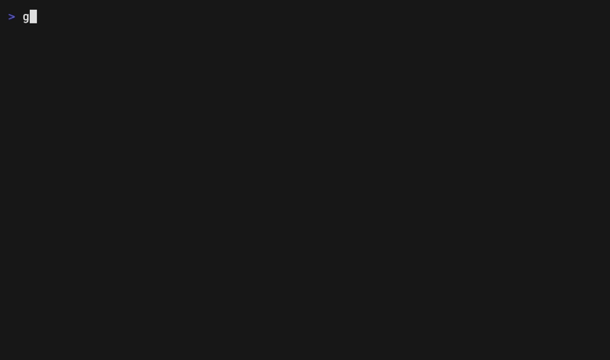

# magetui

A `docker buildx`-style live progress display for [mage](https://magefile.org) builds.



magetui is a Go library — not a CLI, not a mage fork. Import it in your
magefile, wrap the targets you care about, and your build renders as a live
dependency tree: spinners and elapsed timers on running steps, scrolling
output tails, completed subtrees committed to terminal scrollback, and full
output replay for failed steps only.

```go
func All(ctx context.Context) error {
    return magetui.Target(ctx, func(ctx context.Context) error {
        magetui.Deps(ctx,
            magetui.F(Build, magetui.Icon("🔨")),
            magetui.F(Test,  magetui.Icon("🧪")),
        )
        return nil
    })
}
```

## Install

```sh
go get github.com/dmotylev/magetui
```

Go 1.26+. Use it inside a magefile; mage itself is untouched and unaware.

## Principles

- **Renderer, not build system.** `magetui.Deps` reproduces the `mg.Deps`
  contract exactly — parallel, deduped, all siblings run to completion,
  errors aggregated. Only the presentation changes.
- **Explicit opt-in.** Targets migrate one at a time via `magetui.Target`;
  unwrapped targets stay plain mage targets.
- **stdin untouched.** No keyboard handling; interactive subprocesses keep
  working.
- **Degrades honestly.** Non-TTY or `MAGETUI_PROGRESS=plain` gives prefixed
  line-by-line output for CI. `NO_COLOR` and color-profile degradation are
  automatic. Terminal progress (OSC 9;4 — Ghostty, Windows Terminal) is
  emitted where supported.

## Environment

Environment overrides code:

| Variable | Values | Effect |
|---|---|---|
| `MAGETUI_PROGRESS` | `auto` \| `tty` \| `plain` | Renderer selection (default: TTY detection) |
| `MAGETUI_THEME` | `color` \| `greyscale` \| `mono` \| `ascii` | Theme selection |
| `MAGETUI_OSC_PROGRESS` | `on` \| `off` \| `percent` | OSC 9;4 terminal progress (default: emitter detection) |
| `NO_COLOR` | any | Disables color underneath any theme |

## Themes

Four embedded design intents — `color` (default), `greyscale`,
`mono` (no color, full glyphs), `ascii` (glyph-poor terminals) — selectable
via `WithTheme(...)` or `MAGETUI_THEME`. Custom themes are a struct of glyph
strings and lipgloss styles.

## Examples

The demo rig behind the GIF above:

```sh
mage -d examples            # demo: the all-green showcase
mage -d examples fail       # failure replay
mage -d examples panic      # panic presentation
mage -d examples everything # all of it at once; try ^C
```

## Compatibility

Semver covers the Go API, the `MAGETUI_*` environment variables, exit
codes (130 on SIGINT, 143 on SIGTERM), theme names, and plain mode's
structural contract — one line per event, `grep '^!'` finds stderr, `$`
marks commands. Exact rendered output (padding, spacing, TUI frames,
theme glyphs and palettes) is presentation, not API, and may change in
any minor. The full surface: DESIGN.md §10.

## Contributing

DESIGN.md is the source of truth for what magetui is; CONTRIBUTING.md
for how it changes.

## License

[MIT](LICENSE)
